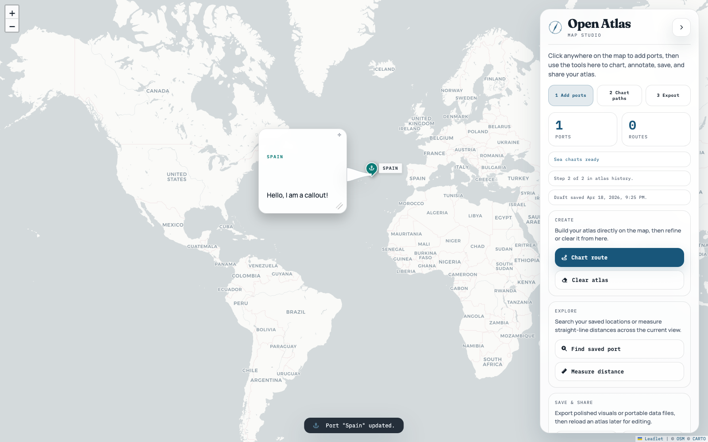

# Open Atlas

Open Atlas is a static, open-source maritime route-mapping app built for easy sharing and zero-backend hosting.



## What it does

- Place ports directly on the map
- Draw sea routes that avoid land using client-side pathfinding
- Choose point icons and per-point colors for clearer map storytelling
- Use the studio comfortably on desktop, tablet, and mobile layouts
- Save and reopen atlases as JSON for continued editing
- Autosave local drafts and restore them later from the control panel
- Undo and redo atlas changes in the browser
- Export maps as PNG with framing and quality controls
- Copy the current map view straight to the clipboard without downloading a file
- Export map data as GeoJSON for GIS and downstream tooling
- Customize title, subtitle, fonts, colors, theme mode, basemap style, and flat presentation sea/land colors
- Keep everything fully static and GitHub Pages friendly

## Use it

Open Atlas is designed for a simple workflow:

1. Create ports and routes.
2. Tweak the visual identity in `Studio Settings`.
3. Let the in-browser draft system keep your latest working state close at hand.
4. Export JSON as the editable master file.
5. Re-import that JSON later to continue working.
6. Use `Undo` / `Redo` when refining the atlas.
7. Copy the current map view when you want a quick paste-ready image.
8. Export PNG for sharing or GeoJSON for interoperability.

## Project layout

- `index.html`
- `assets/styles/app.css`
- `assets/scripts/app.js`
- `assets/open-atlas-verification.png`
- `docs/prototype_with_poe/`

## Documentation

For handoff and continued iteration, use these files as the current source of truth:

- `README.md`
- `docs/CURRENT_APP_DOCUMENTATION.md`
- `docs/IMPLEMENTATION_BACKLOG.md`
- `docs/LLM_HANDOFF.md`
- `THIRD_PARTY.md`

## Run locally

Because the app loads coastline data and tiles over HTTP(S), do not open it with `file://`.

```bash
python3 -m http.server 8000
```

Then open:

```text
http://localhost:8000
```

## GitHub Pages

This repo is a strong GitHub Pages candidate because it is fully static.

The repository now includes a GitHub Pages workflow at `.github/workflows/deploy-pages.yml`.

Recommended setup:

1. Push the repository to GitHub.
2. In repository settings, open `Pages`.
3. Set the source to `GitHub Actions`.
4. Push to `main` to deploy.
5. If you later add a custom domain, enable HTTPS and verify the domain in GitHub.

## Data model

JSON exports are the editable source of truth for the app. They include:

- map view
- ports
- routes
- current visual settings

Draft autosaves reuse the same atlas shape and live only in the browser via `localStorage`.

The app now writes the canonical `open-atlas` JSON format and still accepts the older prototype-era `mariners-atlas` format on import.

GeoJSON exports are for interoperability. They include:

- point features for ports
- line features for routes
- atlas metadata and theme settings

## Contributing

Please read:

- [CONTRIBUTING.md](CONTRIBUTING.md)
- [CODE_OF_CONDUCT.md](CODE_OF_CONDUCT.md)
- [SECURITY.md](SECURITY.md)
- [THIRD_PARTY.md](THIRD_PARTY.md)
- [docs/CURRENT_APP_DOCUMENTATION.md](docs/CURRENT_APP_DOCUMENTATION.md)
- [docs/IMPLEMENTATION_BACKLOG.md](docs/IMPLEMENTATION_BACKLOG.md)

Short version:

- keep it static and easy to host
- preserve export compatibility
- prefer focused PRs
- include screenshots for UI changes

## Next good enhancements

See [docs/IMPLEMENTATION_BACKLOG.md](docs/IMPLEMENTATION_BACKLOG.md) for the execution-ready backlog.

## License

MIT. See [LICENSE](LICENSE).
